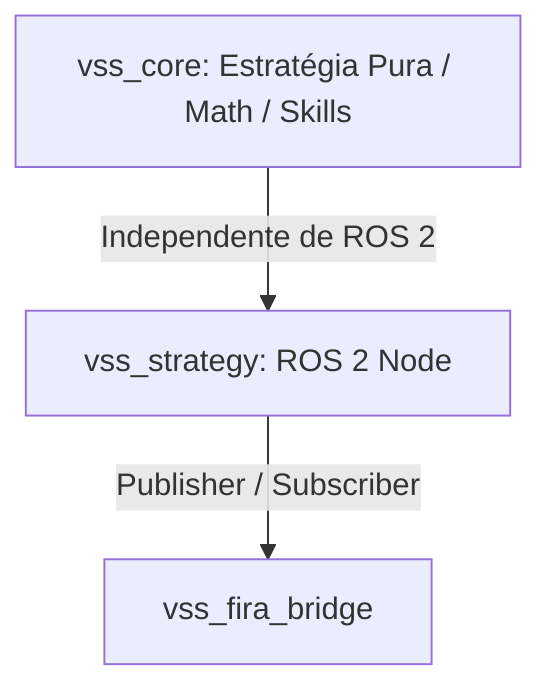

# VssIntel
codigo novo para a modalidade vss
Branch Alpha - modelo teste do Pariz


Aqui está o tutorial passo a passo completo, direto ao ponto e pronto para ser compartilhado com os novos membros do time.

---

# 🤖 Guia de Configuração e Desenvolvimento: VSS (ROS 2 Jazzy)

Este guia cobre o passo a passo necessário para compilar, configurar o ambiente, executar a simulação e entender o fluxo de desenvolvimento do nosso repositório de VSS (Very Small Size Soccer).

---

## 1. Compilação Inicial (Build)

Ao clonar o repositório ou após fazer modificações no código, você precisará compilar o workspace `vss_ws` utilizando a ferramenta **colcon**.

### Como compilar pela primeira vez:
Abra o terminal na raiz do seu workspace (`~/vss_ws`) e execute:

```bash
cd ~/vss_ws
colcon build --merge-install
```

### O que significa o `--merge-install`?
* **Sem a flag (Padrão):** O `colcon` isola a instalação de cada pacote em subpastas separadas (`install/vss_core/...`, `install/vss_strategy/...`). Isso gera caminhos muito longos e pode dificultar a localização de arquivos de configuração.
* **Com `--merge-install`:** Todos os pacotes são instalados em caminhos compartilhados dentro do diretório `install/` (como `install/lib`, `install/share`). Isso torna o carregamento de recursos e scripts de inicialização mais eficiente e limpo.

### Como limpar o cache se algo der errado (Clean Build):
Se você se deparar com erros estranhos de compilação (geralmente causados por mudanças drásticas em assinaturas de funções ou CMakeLists), o melhor caminho é apagar os diretórios gerados e compilar do zero:

```bash
cd ~/vss_ws
rm -rf build/ install/ log/
colcon build --merge-install
```

### Por que o `colcon` é rápido nas próximas compilações? (Compilação Incremental)
O `colcon` detecta quais arquivos de código-fonte foram modificados desde a última compilação. Se um pacote (e seus pacotes dependentes) não sofreu alterações, o `colcon` simplesmente **pula** o build desse pacote (*incremental build*), poupando tempo valioso de desenvolvimento.

---

## 2. Configuração do Ambiente

Para que o terminal reconheça os comandos do ROS 2 e os nós que compilamos no workspace, precisamos carregar as variáveis de ambiente.

### Comandos de carregamento manual (Source):
Toda vez que você abrir um novo terminal, você precisará executar:

```bash
# Carrega os comandos base do ROS 2 Jazzy
source /opt/ros/jazzy/setup.bash

# Carrega os pacotes compilados do nosso workspace
source ~/vss_ws/install/setup.bash
```

### Automatizando no `~/.bashrc` (Recomendado):
Para evitar ter que digitar esses comandos toda vez que abrir uma nova aba ou terminal, adicione-os no final do arquivo de configuração do seu terminal:

```bash
echo "source /opt/ros/jazzy/setup.bash" >> ~/.bashrc
echo "source ~/vss_ws/install/setup.bash" >> ~/.bashrc
source ~/.bashrc
```

---

## 3. Como Rodar Tudo (Ordem de Execução)

A simulação e a inteligência dos robôs funcionam de forma distribuída. Você precisará de **3 terminais separados** rodando simultaneamente na seguinte ordem:

### Passo 1: Abrir o Simulador (Terminal 1)
Navegue até a pasta binária do simulador FIRASim e execute o binário:

```bash
cd ~/FIRASim/bin
./FIRASim
```
*(Nota: Certifique-se de que a janela do simulador abriu corretamente antes de prosseguir).*

### Passo 2: Abrir o Juiz / Referee (Terminal 2)
Se a sua categoria ou treino utilizar um sistema de juiz externo para controle automático de faltas, posicionamento de bola e início de partida, execute-o no segundo terminal:

```bash
# Caso utilize o executável do VSSRef ou similar:
cd ~/VSSRef/bin
./VSSRef
```
*(Se o juiz estiver integrado ao FIRASim ou se você for controlar as faltas manualmente pelo painel do simulador, esta etapa pode ser ignorada).*

### Passo 3: Rodar a Inteligência e a Ponte de Comunicação (Terminal 3)
Com o simulador aberto, execute o arquivo de inicialização do ROS 2 para levantar a nossa estratégia, a visão e a ponte que envia comandos para o FIRASim:

```bash
ros2 launch vss_bringup sim.launch.py
```
Esse comando iniciará todos os nós necessários de uma só vez (`vss_strategy`, `vss_fira_bridge`, `vss_vision`, etc.).

---

## 4. Onde Modificar o Código (Workflow de Dev)

Para manter o código limpo, dividimos a arquitetura em duas responsabilidades bem claras:



### vss_core vs vss_strategy
1. **`vss_core` (Estratégia Pura e Playbook):** Contém toda a lógica de tomada de decisão de alto nível, cálculo matemático de campos vetoriais, predição física da bola e *skills* (comportamentos básicos dos robôs). Ele **não** depende de bibliotecas do ROS 2. Isso permite portar a física e a lógica matemática facilmente para outros ambientes.
2. **`vss_strategy` (Nó do ROS 2):** É o intermediário que encapsula a lógica do `vss_core` dentro de um nó ROS. Ele recebe os tópicos de visão (`/vision_packets`) e juiz (`/referee`), converte as coordenadas para as structs do `vss_core`, roda o loop de tática em um timer fixo (ex: 60Hz) e publica os comandos de velocidade (`/robot_commands`).

### Fluxo Correto de Desenvolvimento (Workflow):
1. **Modificar o código:** Abra o editor e edite os arquivos de comportamento (dentro de `vss_core` ou `vss_strategy`).
2. **Compilar apenas o necessário (Rápido):** Se você alterou apenas a estratégia, compile especificando o pacote para economizar tempo:
   ```bash
   colcon build --merge-install --packages-select vss_strategy
   ```
3. **Parar a execução anterior:** No terminal 3 (onde está rodando o launch), aperte `Ctrl + C` para encerrar os nós.
4. **Testar:** Execute o launch novamente:
   ```bash
   ros2 launch vss_bringup sim.launch.py
   ```
